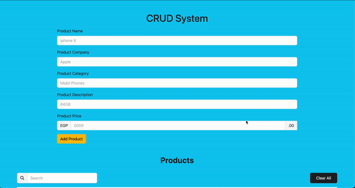
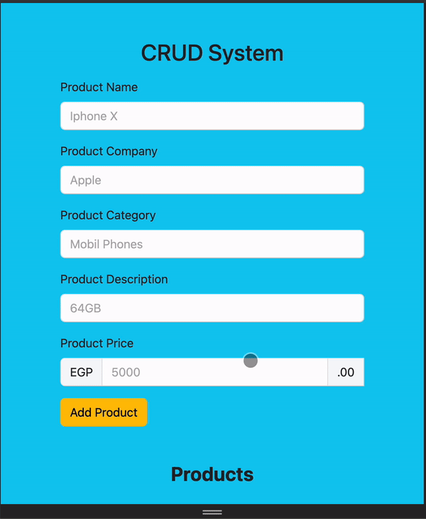

# 🚀 CRUD System with JavaScript, HTML, CSS, & Bootstrap

Manage your items with ease – Create, Read, Update, and Delete!

## Project Description
This CRUD system is a web application built with JavaScript, HTML, CSS, and Bootstrap that allows users to Create, Read, Update, and Delete items in a list. The data is saved in the browser's local storage, ensuring it persists even after page reloads, without the need for a server or database.

## Usage
To interact with the CRUD system, simply:
- **Create**: Add new items to the list using the input form.
- **Read**: View the list of existing items.
- **Update**: Edit any item in the list by clicking the "Update" button.
- **Delete**: Remove an item by clicking the "Delete" button.
- **Clear**: Remove all itemw by clicking the "Clear All" button.

## Code Explanation
The CRUD system uses the browser’s `localStorage` to store data, meaning the items you add, update, or delete are saved locally and persist even after a page refresh. JavaScript methods like `localStorage.setItem()` and `localStorage.getItem()` are used to handle storing and retrieving data.

### Features
- Real-time item management (Add, Edit, Delete) with visual feedback.
- Responsive layout for mobile, tablet, and desktop screens using Bootstrap.
- Data persistence using browser’s local storage (no server needed).

## Learning Outcomes
Working on this project allowed me to:
- Gain a deeper understanding of JavaScript ES6 features like `let`, `const`, and arrow functions.
- Practice DOM manipulation for real-time UI updates.
- Improve my skills in responsive design using Bootstrap.

## Screenshots
### CRUD System in Action

### Mobile View

